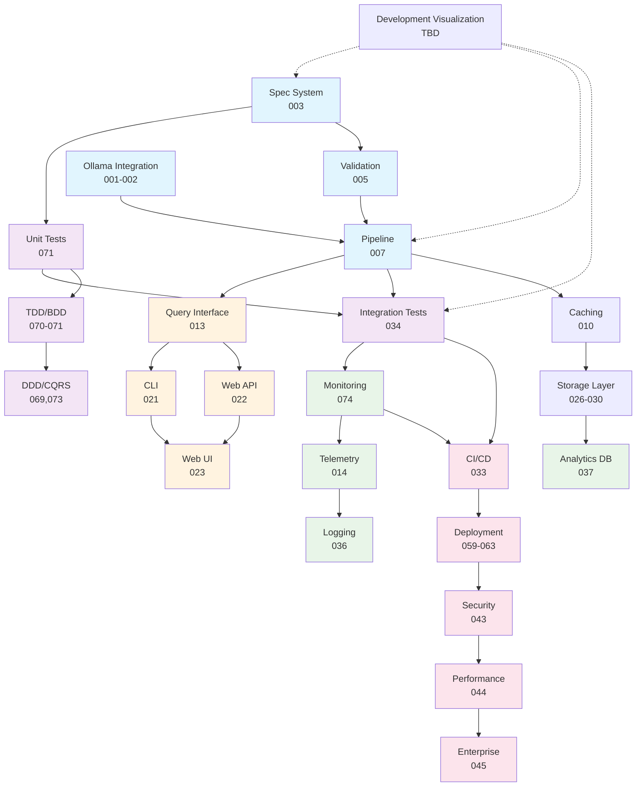

# RepoMind 🧠


An intelligent repository analysis system that gives repositories the ability to understand and explain themselves.

## Overview

RepoMind transforms static code repositories into queryable knowledge bases by combining GitHub API data with local LLM capabilities (Ollama) through a type-safe, spec-driven architecture.

## Key Features

- **Type-Safe**: Every API interaction validated against specifications
- **Local-First**: Uses Ollama for privacy-preserving LLM analysis
- **Composable**: Build complex analysis workflows from simple parts
- **Scheme-Based**: Leverages Guile Scheme for powerful metaprogramming
- **Spec-Driven**: Heavy focus on formal specifications and contracts

## Development Through Experimentation

RepoMind follows an **experiment-driven development** approach where each capability is validated through systematic experiments before implementation.



### Experiment-Driven Development Philosophy

**Specification-Driven Core** (Blue)
- Formal contracts and validation at every boundary
- Spec-to-code generation and bidirectional validation
- Type safety through systematic specification

**Testing Foundation** (Purple)  
- Unit tests drive core module design
- Integration tests validate system behavior
- TDD/BDD methodology experiments

**System Integration** (Green)
- Monitoring and telemetry as first-class concerns
- Analytics and logging infrastructure
- Observability-driven development

**User Experience** (Orange)
- CLI and web interfaces built on solid foundation
- Query interface enabling natural language interaction
- Design systems for consistent experience

**Production Systems** (Pink)
- CI/CD and deployment automation
- Security and performance optimization
- Enterprise-grade capabilities

## Experiment Dependencies

| Phase | Experiments | Dependencies | Key Technologies |
|-------|------------|--------------|------------------|
| 1 | 01-20 | - | Ollama, Guile Scheme, GitHub API |
| 2 | 21-25 | Phase 1 | CLI frameworks, Web frameworks |
| 3 | 26-30 | Phase 1-2 | SQLite, PostgreSQL, LocalStack |
| 4 | 31-35 | Phase 1-3 | GitHub Actions, Docker |
| 5 | 36-40 | Phase 1-4 | OpenTelemetry, Grafana |
| 6 | 41-45 | Phase 1-5 | Plugin architecture, Security tools |
| 7 | 59-63 | Phase 1-6 | Kubernetes, Chaos engineering |
| 8 | 64-68 | Phase 1-7 | Developer tools, Documentation |
| 9 | 69-73 | Phase 1-8 | Event stores, CQRS frameworks |

## Technology Stack

### Core Dependencies
- **Operating System**: FreeBSD 14.3-RELEASE
- **Language**: GNU Guile 2.2.7
- **LLM Runtime**: Ollama 0.9.6
- **OpenAPI**: Version 3.1.0 (for API specifications)

### Development Tools
- **Databases**: PostgreSQL 15+, SQLite 3.40+
- **Containers**: Docker 24+, Docker Compose
- **Cloud Simulation**: LocalStack
- **Testing**: Expect, QuickCheck for Scheme
- **CI/CD**: GitHub Actions
- **Monitoring**: OpenTelemetry, Prometheus

### Guile-Specific Tools
- **Static Analysis**: 
  - `guild compile` with `-W` flags for warnings
  - Custom spec validation tools (to be developed)
- **Testing**: SRFI-64 test framework
- **Documentation**: Texinfo
- **Package Management**: Guix (optional)

### Formal Methods & Specifications
- **Contract System**: Design by Contract patterns
- **Spec Languages**: S-expressions for DSLs
- **Validation**: JSON Schema validation
- **API Specs**: OpenAPI 3.1.0
- **Type Systems**: Gradual typing experiments

## Current Experiment Status

🧪 **Experiment-Driven Development: 25% Complete** 

📊 **[Phase 1 Completion Report](https://gist.github.com/aygp-dr/9e8b3528ebf9998d169b1ebe15ca30cf)**

### ✅ Phase 1 Complete (Experiments 009-020)
- **009**: Error handling with retry logic and circuit breakers
- **010**: LRU cache with TTL support (43% hit rate demonstrated)  
- **011**: Token bucket rate limiting for API quotas
- **012**: Concurrent request patterns with work queues
- **013**: Natural language query interface with intent classification
- **014**: Telemetry foundation for metrics collection
- **015**: Response evaluation with quality scoring
- **016**: Prompt optimization (structured = 90% quality)
- **018**: Tool execution sandbox with security filtering
- **019**: Tool integration registry and dispatch  
- **020**: Production readiness assessment (5/5 checks)

### 📋 Ready for Implementation
- **Experiments 001-008**: Core foundations (scaffolded, awaiting implementation)
- **Experiments 021-100**: Future phases building on Phase 1 success

### Experiment Philosophy
Each experiment follows: `gmake -C experiments/XXX-name run`

**Benefits of this approach:**
- **Rapid prototyping** - Test ideas quickly without full integration
- **Risk reduction** - Discover issues early in isolated contexts  
- **Knowledge capture** - Document discoveries for future implementers
- **Parallel development** - Multiple agents can work on different experiments
- **Incremental progress** - Each experiment builds system understanding

## Quick Start

```bash
# Clone the repository  
git clone https://github.com/aygp-dr/repomind.git
cd repomind

# Check dependencies
make validate-deps

# Run working experiments
gmake -C experiments/009-error-handling run
gmake -C experiments/010-caching-layer run
gmake -C experiments/011-rate-limiting run
gmake -C experiments/012-concurrent-requests run

# Run all phase 1 experiments (when ready)
make phase-1
```

## Architecture

```
GitHub API → Validation → Transformation → Ollama LLM → Validation → Output
     ↓            ↓             ↓              ↓            ↓          ↓
   [Spec]      [Spec]        [Spec]         [Spec]      [Spec]    [Spec]
```

## Project Structure

```
repomind/
├── experiments/          # Incremental validation experiments
├── src/                 # Core library code (future)
├── specs/               # Formal specifications
├── tests/               # Test suites
├── docs/                # Documentation
└── tools/               # Development tools
```

## Contributing

This is an experimental project exploring spec-driven LLM integration. Contributions focusing on formal specifications, contract design, and type safety are especially welcome.

## License

MIT