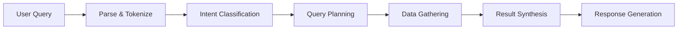

# Experiment 013: Query Interface

## Overview
Create a natural language query interface that allows users to ask questions about repositories and receive intelligent, context-aware responses.

## Goals
- Parse natural language queries about repositories
- Classify query intent (analysis, search, statistics, etc.)
- Route queries to appropriate handlers
- Generate human-readable responses
- Support follow-up questions with context

## Success Criteria
- [ ] Common query types handled correctly
- [ ] Ambiguous queries clarified intelligently
- [ ] Context maintained across conversations
- [ ] Responses are accurate and helpful
- [ ] Query suggestions improve usability

## Dependencies
- Experiment 012: Concurrent requests (for efficient data gathering)

## Files
- `query-parser.scm` - Natural language parsing
- `intent-classifier.scm` - Determine query purpose
- `query-planner.scm` - Plan execution strategy
- `response-generator.scm` - Format results naturally

## Running the Experiment
```bash
make test MODEL=llama3.2
```

## Query Types

### Repository Analysis
- "What does this repository do?"
- "Explain the main functionality"
- "What problems does it solve?"

### Code Understanding
- "How does the authentication work?"
- "What design patterns are used?"
- "Show me the API endpoints"

### Contributor Insights
- "Who are the main contributors?"
- "What expertise is needed?"
- "Who maintains this module?"

### Issue/PR Analysis
- "What are the open bugs?"
- "Show recent performance issues"
- "What features are planned?"

### Architecture Queries
- "What's the project structure?"
- "Which frameworks are used?"
- "How are components organized?"

## Query Processing Pipeline



## Intent Classification
```scheme
(define query-intents
  '((analysis . ("what" "explain" "describe" "how"))
    (search . ("find" "show" "list" "get"))
    (statistics . ("count" "how many" "statistics"))
    (comparison . ("compare" "difference" "better"))
    (history . ("when" "recent" "latest" "changes"))))
```

## Context Management
- Maintain conversation history
- Track referenced entities
- Support pronouns ("it", "that", "this")
- Remember user preferences

## Example Interactions
```
User: What does the repomind repository do?
Assistant: RepoMind is an intelligent repository analysis system that...

User: How does it work with Ollama?
Assistant: RepoMind integrates with Ollama by sending repository data...

User: Show me the main components
Assistant: The main components are:
1. Repository Fetcher - Retrieves GitHub data
2. LLM Pipeline - Processes with Ollama
3. Query Interface - Natural language processing
...
```

## Results
Status: ⏳ Pending - Core user interaction feature