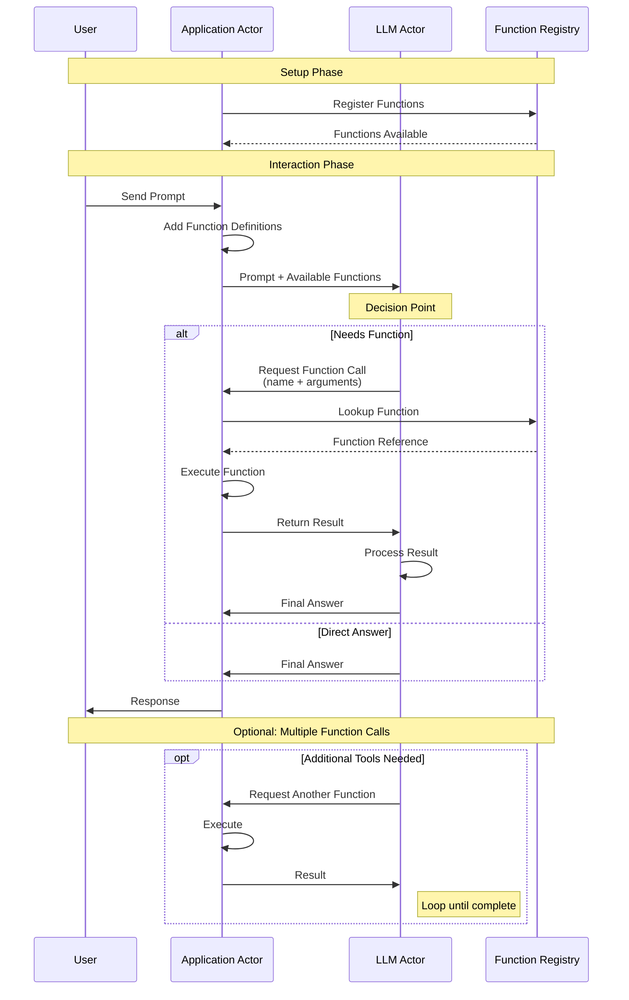

# Experiment 17: Tool Specification Framework

## Overview
Define a specification format for tools that Ollama can call, with type safety and validation.

## Goals
- Create tool specification DSL
- Define core read-only tools
- Validate tool specifications
- Generate tool documentation

## Success Criteria
- [ ] Tool spec format is expressive and safe
- [ ] Core tools (read_file, list_files) specified
- [ ] Specifications validate correctly
- [ ] Can generate JSON for Ollama

## Files
- `tool-spec-format.scm` - Define the specification DSL
- `core-tools/` - Essential tool specifications
  - `file-tools.scm` - read_file, list_files
  - `search-tools.scm` - search_code, find_pattern
- `spec-validation/` - Validate tool specs

## Tool Specification Example
```scheme
(define-tool read_file
  :description "Read contents of a file"
  :parameters ((path :type string :required #t))
  :returns ((content :type string))
  :constraints ((file-exists? path)))
```

## Tool Calling Research

### Objective
Understand the exact response format when tools are called and how to handle various scenarios.

### Test Scenarios
1. **Successful tool call** - Model correctly identifies need for tool
2. **No tool needed** - Model answers without tools
3. **Multiple tools** - Model chooses correct tool
4. **Invalid tool call** - Model calls with wrong parameters
5. **Tool execution error** - What happens when tool fails

### Tasks
- [ ] Create test script with multiple tools
- [ ] Test each scenario above
- [ ] Document exact response structure for each case
- [ ] Identify how to detect tool calls in response
- [ ] Test error handling paths

### Key Questions
1. How do we detect if model wants to call a tool?
2. What's the exact structure of function_call in response?
3. How do we extract function name and arguments?
4. What's the format for sending tool results back?
5. How does model indicate it needs multiple tool calls?

### Response Format Investigation
```python
# For each response, log:
# - response.candidates structure
# - How to detect function_calls
# - Parameter extraction method
# - Result format expectations
```

### Tool Calling Sequence Diagram


### Deliverable
Document the complete response handling flow in comments within the test script.

## Running the Experiment
```bash
make test
make validate-specs
```

## Dependencies
- Experiment 03 (spec system)

## Results
Status: ⏳ Pending